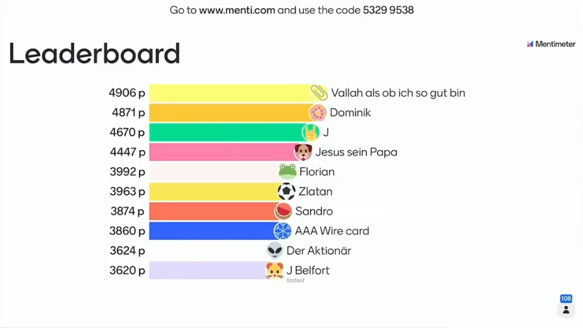

# centimenti - a simple Python mentimeter bot

## Python bot for playing [mentimeter](https://www.mentimeter.com/) quizzes with brute-force or 'alwaysB' strategy.

Centimenti was implemented as a fun university project. It is a simple bot for
playing [mentimeter](https://www.mentimeter.com/) quizzes using two strategies:

**alwaysB** chooses - like the name suggests - always answer B. It is not
recommended to use this strategy in order to win. With a little luck a few
points will be collected. Centimenti will be one of the first players to answer;
so if you get lucky, you will gain more points for answering fast.

**everythingOnce** will definitely outplay any human player - as long as the
number of questions is relatively low and you run this script on a machine
capable of creating #answers<sup>#questions</sup> players. With a decent laptop
we were able to temporarily occupy most places on the leaderboard and win the
game in a 4 answers à 4 questions game (see below).

Centimenti is not optimized for performance. It opens a new browser window for
each player. In order to 'overcome' performance issues, you can start the script
on two separate systems and generate a subset of players on each of them.


## How can I use the bot?

Clone the repository and execute the script.

### Requirements

We need the python [selenium](https://www.selenium.dev/) module to be able to
control a web-browser.
```
pip install selenium
```
Make sure you also have the **Firefox** browser driver installed and added to
path. The following two links may help:
- [https://www.selenium.dev/documentation/getting_started/installing_browser_drivers/](https://www.selenium.dev/documentation/getting_started/installing_browser_drivers/)
- [https://www.selenium.dev/documentation/webdriver/getting_started/install_drivers/#2-the-path-environment-variable](https://www.selenium.dev/documentation/webdriver/getting_started/install_drivers/#2-the-path-environment-variable)

If you don't want to use Firefox, you have to change a few lines of code. But
that shouldn't be too difficult.

### Parameters

```
usage: centimenti [-h] [--version] [-c GAME_CODE] [-s {alwaysB,everythingOnce}] [-q] [-a]
                  [-n PLAYER_NAMES [PLAYER_NAMES ...]] [--slow_start] [--headless]

Bot that plays quizzes on menti.com

optional arguments:
  -h, --help            show this help message and exit
  --version             show program's version number and exit
  -c GAME_CODE, --game_code GAME_CODE
                        Specify the game code.
  -s {alwaysB,everythingOnce}, --strategy {alwaysB,everythingOnce}
                        Specify the playing strategy.
  -q , --number_of_questions
                        Specify the number of questions asked.
  -a , --number_of_answers
                        Specify the maximum number of answers the player can choose in each
                        question.
  -n PLAYER_NAMES [PLAYER_NAMES ...], --player_names PLAYER_NAMES [PLAYER_NAMES ...]
                        Specify a list of names that will be used to create the players.
  --slow_start          The players will be created with a small delay.
  --headless            Operates the browsers headless.
```


## See centimenti in action

The following two screenshots show the terminal and a few bots in a demo quiz.

<details><summary>Joining the game.</summary><p>


</p></details>

<details><summary>Answering</summary><p>


</p></details>

<br>

We used centimenti in one of our lectures. Of course we had to test it
somehow :) We only used centimenti to win once (see [disclaimer](#disclaimer)).

Due to [known problem](#Known-problems) 1 we had to start guessing from question
5 onwards. Unlike the last quizzes, this quiz had 8 instead of 4 questions.

<details><summary>Question 1: 6 / 10 places on leaderboard.</summary><p>

- (1) Klara Fall
- (3) Dr Akula
- (4) Ed Ding
- (6) Vallah als ob ich so gut bin
- (7) Dick S Ding
- (8) Henriette


</p></details>

<details><summary>Question 2: 2 / 10 places on leaderboard.</summary><p>

- (1) Henriette
- (2) Vallah als ob ich so gut bin


</p></details>

<details><summary>Question 3: 3 / 10 places on leaderboard.</summary><p>

- (1) Vallah als ob ich so gut bin
- (9) Dr Akula
- (10) Henriette


</p></details>

<details><summary>Question 4: 2 / 10 places on leaderboard.</summary><p>

- (1) Vallah als ob ich so gut bin
- (10) Dr Akula


</p></details>

<details><summary>Question 5: 1 / 10 places on leaderboard.</summary><p>

- (1) Vallah als ob ich so gut bin


</p></details>

<details><summary>Question 6: 1 / 10 places on leaderboard.</summary><p>

- (1) Vallah als ob ich so gut bin



</p></details>

<details><summary>Question 7: 1 / 10 places on leaderboard.</summary><p>

- (2) Vallah als ob ich so gut bin


</p></details>

<details><summary>Question 8: 1 / 10 places on leaderboard - WINNER</summary><p>

- (1) Vallah als ob ich so gut bin


</p></details>


## Limitations

Centimenti only works with Mentimeters slide type *Select Answer*.

The similar type *Multiple Choice* will not work. The script could be adapted to
recognize the answer buttons for multiple choice. Implementing a (winning)
strategy would be far more difficult, however.


## Known problems

I know of the following problems with this script. Centimenti was implemented
as a fun university project with no real use-case, so I will most likely not
fix these issues. Feel free to fix the problems and create a pull request.

- **More questions than anticipated**

    If the number of questions is higher than specified at startup, the bots
    will stop playing. The browsers will remain open for another 10 minutes. At
    this point you have to start guessing / answering yourself - good luck!

- **Number of questions not equal to number of answers**

    In our course the number of questions almost always equaled the number of
    answers, so I did not bother to implement a semi-random answers-selector.

- **Manually closing browser windows**

    Manually closing browser windows will result in a crash of the script.


## Disclaimer

Please use this script wisely. Most professors that use quizzes from
mentimenter, etc. do so in order to make learning more fun. We used this script
because it was fun implementing and seeing 'our' names on the leaderboard. As
soon as we won one quiz we stopped using the script for reasons of fairness
towards our fellow students.
